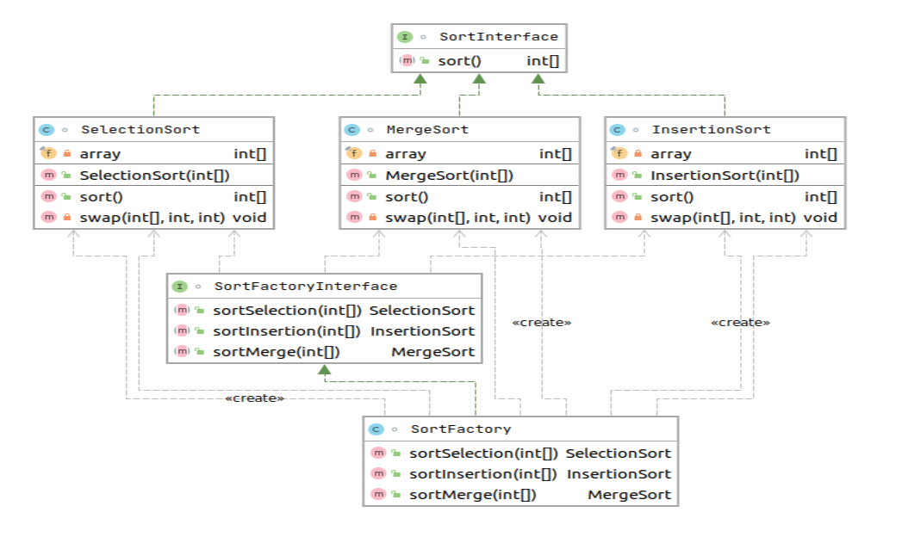

# Реализация выбора подходящего метода сортировки (выбором, вставки, слиянием)

Цель: Получите навык работы с абстрактной фабрикой.

Данные задаются в файле. Результат также помещается в файл.
1. Выбрать массив размером 50 элементов.
2. Создать программу, которая в качестве входного параметра получает вариант сортировки (выбором, вставки, слиянием), имя файла со входным набором данных и имя файла с выходными данными.
3. Реализовать в программе абстрактную фабрику и конкретные фабрики, отвечающие за каждый вариант сортировки как продукты.
4. Программа записывает результаты в выходной файл данных. В содержании в пишется тип сортировки и результаты.

# Тесты

`mvn clean test`

# Описание

Проверка осуществляется в тестах. 
Используется абстрактная фабрика для выбора метода сортировки `SortFactory` 

