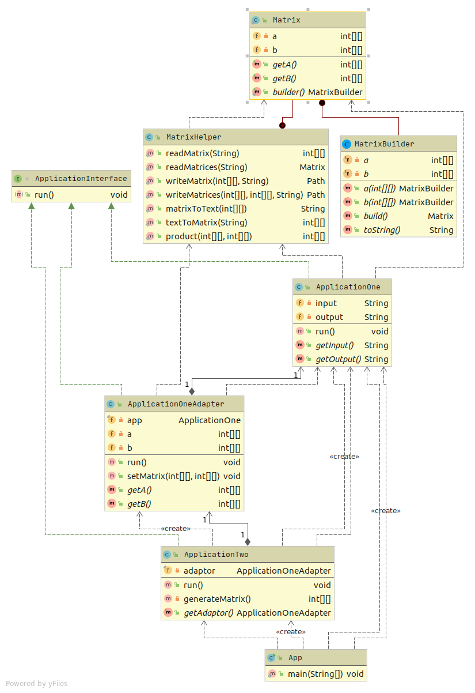

# Адаптер для работы двух независимых программ

Цель: 
1. Вы напишете адаптер, чтобы связать функционал двух отдельных программ в единый процесс. разберётесь с тем, как адаптер работает в случае вызова отдельных программ. Получите навыки работы с формальными и фактическими параметрами передачи данных
2. Получите навык анализа системы - использовать или нет этот шаблон в проектной работе.

Написать простую консольную программу П1, с интерфейсом вызова И1, которая читает данные о двух матрицах А и В из файла F0, складывает матрицы и сохраняет результат А+В в другой файл F1.
Написать вторую консольную программу П2, которая может генерить данные матриц А и В и писать их в файл с именем F2.
Чтобы она могла их просуммировать, следует сделать адаптер для программы П1, который позволит программе П2 вызвать П1.
1. Написать программу П1
2. Написать программу П2, включив туда адаптер вызова и использования программы П1
3. Написать автотест для проверки функционирования
4. Если потребуется использовать адаптер в проектной работе, предоставить описание в текстовом файле в GitHub репозитории где конкретно и в какой роли используется этот шаблон.

# Тесты

`mvn clean test`

# Описание

`ApplicationOne` - программа П1, читает данные о двух матрицах (A и B) из файла input.csv (F0), складывает матрицы, и пишет результат в файл output.csv (F1).

`ApplicationTwo` - программа П2, генерирует марицы и передает в адаптер приложения П1.

`ApplicationOneAdapter` - адаптер реализует интерфейс И1 для вызова программы П1 из программы П2.

`MatrixHelper` - работа с матрицами.

`src/main/resources/input.csv` - пример файла с матрицами на вход П1.
  
Для вызова используется адаптер `ApplicationOneAdapter`, который на вход принимает матрицы, адаптирует и передает в приложение П1.  

