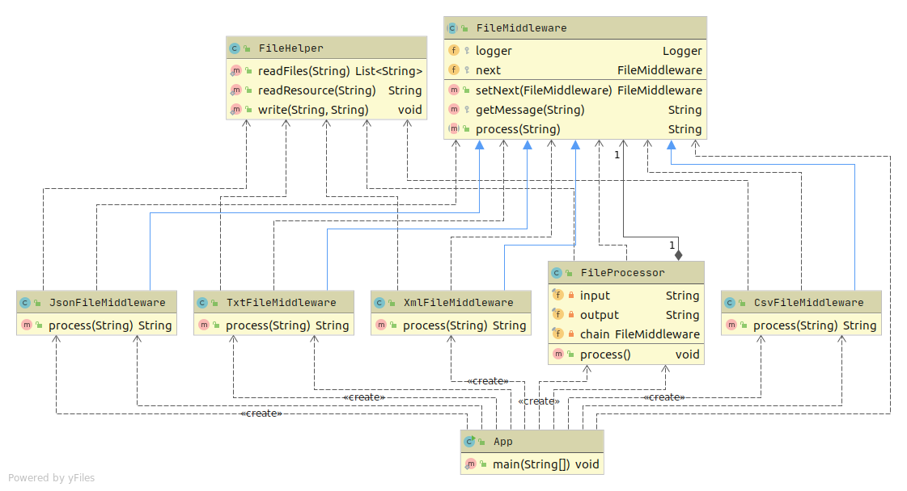

# Цепочка обязанностей

Парсер файлов в зависимости от их типа и описание применения шаблона в проекте

Цель: Получите навыки применения шаблона "цепочка ответственности"

Программа, реализующая алгоритм, получает на вход список файлов. И каждый попадает в обработку алгоритма.

На вход алгоритма передаётся ряд файлов, которые имеют различный тип (Xml, JSON, CSV, txt)
Требуется создать цепочку обработки этих файлов, где отдельный обработчик отвечает за обработку конкретного типа документа.
Обработчик логирует получение подходящего ему файла в виде "обработчик TXT получил файл filename.txt" и копирует содержимое в выходной файл.

Требуется:

1. создать программу, где на вход подаётся путь файла со списком обрабатываемых файлов и путь выходного файла.
2. реализовать алгоритм обработки с помощью шаблона "Цепочка ответственности"
3. нарисовать диаграмму классов.
Если потребуется использовать шаблон в проектной работе, предоставить описание в текстовом файле в GitHub репозитории где конкретно и в какой роли используется этот шаблон.

# Тесты

`mvn clean test`

# Описание

Используется цепочка обязанностей. Сначала объявляется вся цепочка в нужной последовательности, затем передается вместе с остальными данными в `FileProcessor` для дальнейшей обработки.

`FileMiddleware` - базовый класс цепочки.

`CsvMiddleware, TxtMiddleware, JsonMiddleware, XmlMiddleware` - конкретные реализации обработчиков.

`src/main/resources/input.txt` - файл, подающийся на вход, содержит список имен файлов для обработки.

  

