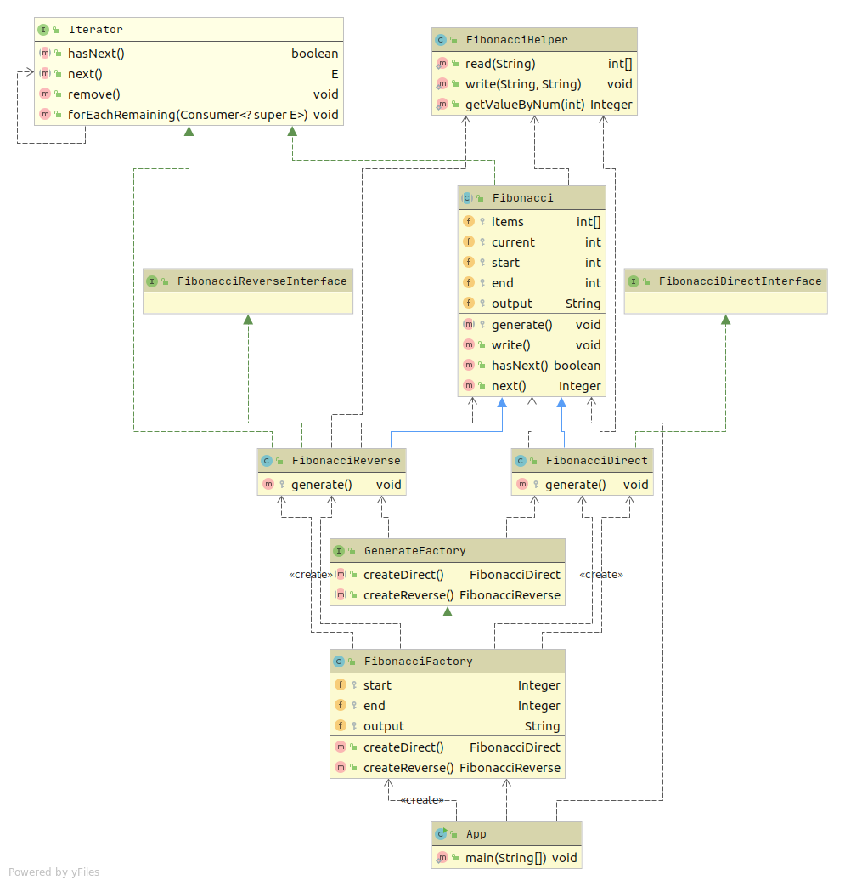

# Генератор чисел Фибоначчи и описание применения шаблона в проекте

Цель: Получите навыки применения шаблона "итератор" и знания формировании чисел Фибонначи

1. Создать программу, которая генерит числа фибонначи в указанном диапазоне в указанный файл. 
Предусмотреть возможность движения в обратном направлении (например, с использованием формулы Binet)
2. Реализовать в программе абстрактную фабрику и конкретные фабрики, отвечающие за каждый вариант сортировки как продукты.
3. Программа записывает результаты в выходной файл данных.
4. Если потребуется использовать Итератор в проектной работе, предоставить описание в текстовом файле в GitHub репозитории где конкретно и в какой роли используется этот шаблон.

# Тесты

`mvn clean test`

# Описание

На вход принимает порядковые номера начального и конечного элемента (включительно), файл в которых будет записан вывод. 

Итераторы реализуют продукты `FibonacciDirect` и `FibonacciReverse`. Непосредственно итерация происходит в `Fibonacci::write`/ 

`GenerateFactory` - абстрактная фабрика

`FibonacciFactory` - реализует абстрактную фабрику и возвращает продукты как итераторы.

`FibonacciDirect` - прямая сортировка как продукт. Является итерируемым.

`FibonacciReverse` - обратная сортировка как продукт. Является итерируем. 

`src/main/resources/input.csv` - пример файла с матрицами на вход. Содержит массив матриц.
  

