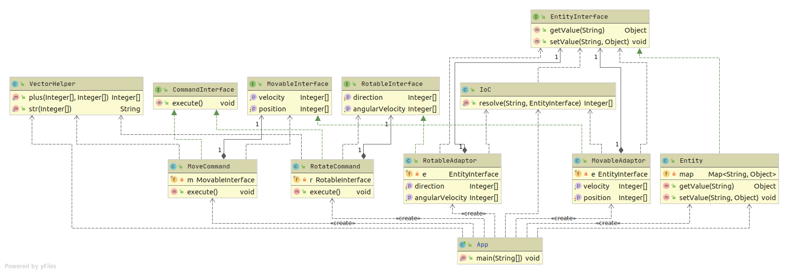

# Практика SOLID, игра "Танковый бой"

Предположим, что нам необходимо разработать игру Танковый бой.
Исходное описание игры:
С каждой стороны играют по три танка. Танки могут двигаться по прямой, поворачиваться против и по часовой стрелке, стрелять.
Попадание снаряда в танк уничтожает его. Выигрывает та команда, которая уничтожит первой все танки соперника,
Управление танками осуществляется компьютерными программами (то есть не клавиатуры).

Концептуально игра состоит из трех подсистем:
1. Игровой сервер, где реализуется вся игровая логика.
2. Player - консольное приложение, на котором отображается конкретный танковый бой.
3. Агент - приложение, которое запускает программу управления танками от имени игрока и отправляет управляющие команды на игровой сервер.

Реализовать поворот танка вокруг собственной оси.
Критерии оценки: Критерии приемки задач:
1. Код опубликован в репозитории на gitlab.
2. Опубликованный код собирается без ошибок с помощью системы сборки.
3. Абстракции, созданные при решении задачи, устойчивы относительно изменения требований к игре, то есть соответствуют SOLID.
!!! Это, пожалуй, самое важно условие.
4. Написан набор тестов, который обеспечивает 90% кода тестами. Тесты все успешно выполняются.

# Тесты

`mvn clean test`

# Описание

Код устойчив к изменению требований. Соблюдается принцип OCP (open-closed principle). 

`Entity` - универсальный класс юнита. Хранит характеристики в мапе, что дает универсальность при добавлении/удалении новых характеристик.   

`MovableInterface` - интерфейс юнитов, которые могут передвигаться

`MovableAdaptor` - адаптер для перемещения и универсального юнита

`MoveCommand` - команда вызова перемещения

`RotableInterface` - интерфейс юнитов, которые могут вращаться

`RotableAdaptor` - адаптер для вращения и универсального юнита

`RotateCommand` - команда вызова вращения 

