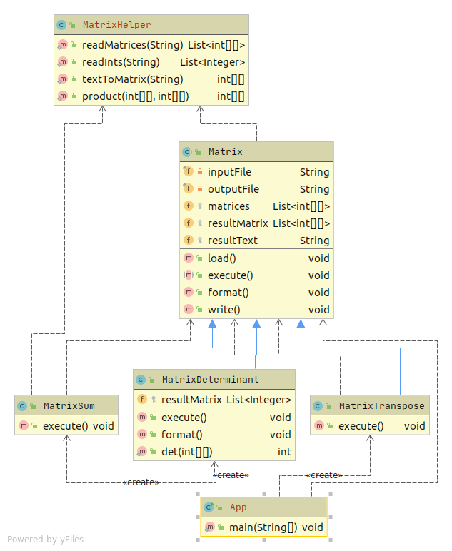

# Шаблонный метод

Реализация выбора подходящего метода матричных операций с применением шаблонного метода и описание применения шаблона в проекте

Цель: Получите навыки в программировании алгоритмов матричных операций, применении шаблонного метода.

Есть несколько операций над матрицами:
1. транспонирование матрицы
2. сложение матриц
3. найти определитель матрицы

Написать программу, которая выполняет следующее:

0 на входе получает название входного файла, выходного файла и вид операции
1. Получает данные из файла
2. Выполняет указанную операцию над данными
3. Формирует данные для вывода в необходимом формате
4. Записывает данные в выходной файл
5. Если потребуется использовать Шаблонный метод в проектной работе, предоставить описание в текстовом файле в GitHub репозитории где конкретно и в какой роли используется этот шаблон.

# Тесты

`mvn clean test`

# Описание

`Matrix` - базовый класс для шаблона. Реализует базовый функционал общий для наследуемых классов.

`MatrixSum` - вычисление суммы матриц. Наследуется от `Matrix`. На вход подается две матрицы, а на выходе одна матрица.

`MatrixTranspose` - транспонирует матрицу. Наследуется от `Matrix`. На вход подаются матрицы (или одна матрица), на выходе массив транспонированных матриц.

`MatrixDeterminant` - вычисление детерминанта. Наследуется от `Matrix`. На вход подаются матрицы (или одна матрица), на выходе массив детерминантов для каждой матрицы.

`MatrixHelper` - простые переиспользуемые методы для работы.

`src/main/resources/input.csv` - пример файла с матрицами на вход. Содержит массив матриц.
  

